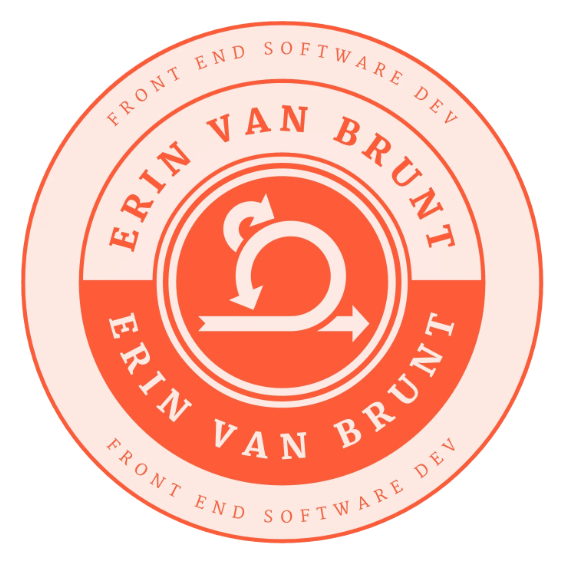

# 
 Erin's Portfolio 

## <u>
Summary / MVP
</u>

This app will be a profession portfolio, to be used for finding jobs. It will display
different technologies, sections (such as games & Erin's resume), auth to log in and
API connections & routes.

Technologies Used: React.js, Ruby, Javascript, Rails, RESTful Routing, React-router-dom5.2.0, CSS, HTML, JSX, Auth, DB relationships, Seeding, Sockets for email integration, validations, API interactions & Redux.

## <u>
User Story
</u>

1. The Login page will appear letting you login to previously created accounts. If you need
   to create an account, under that form is a button labeled "create new account." This hides the login form and lets you sign up. Both forms ask for name, email & password. You choose one and click "enter".

2. Once you've entered you are show the home page. This features information about Erin Van Brunt's career journey, and future. The top of the page shows the navigation bar with links to "game", "resume", "past projects" & "log out."

3. The game page allows you to play and saves your scores / data to the right hand side of the page.

4. The resume page shows you Erin's resume, links & contact info.

5. Past projects has links to deployed projects, their creation date & a back story.

6. Log out page brings you to the empty form shown in step 1.

## <u>
Schema
</u>

## <u>
Stretch Goals
</u>

1. Tune up Bird Games
2. Add previous projects.

- 2 Games (one that is win/lose, one that allows you to create art)
